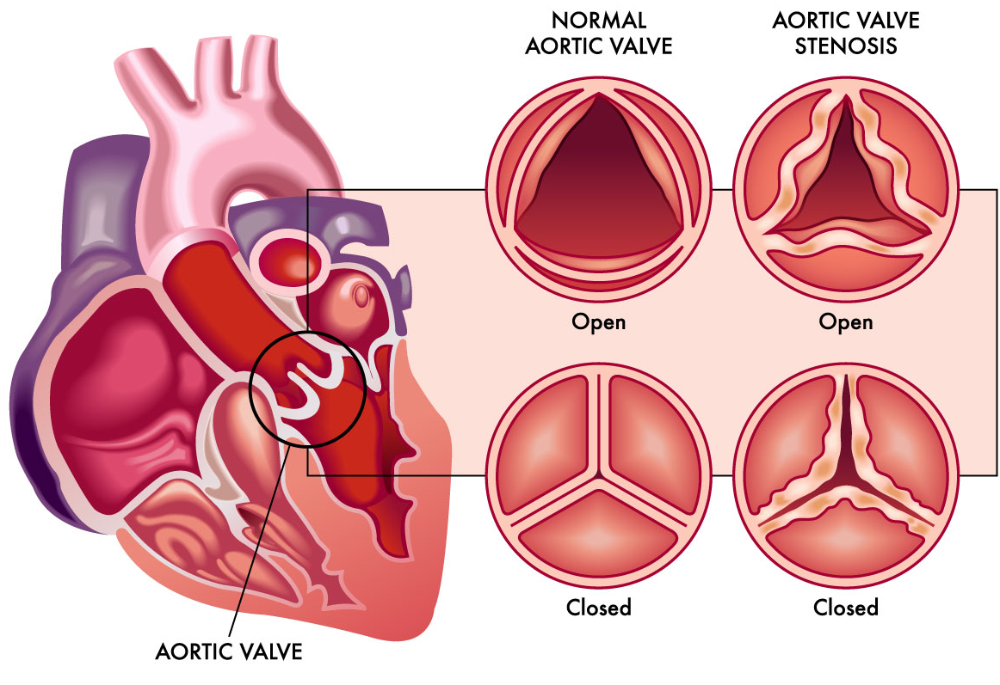
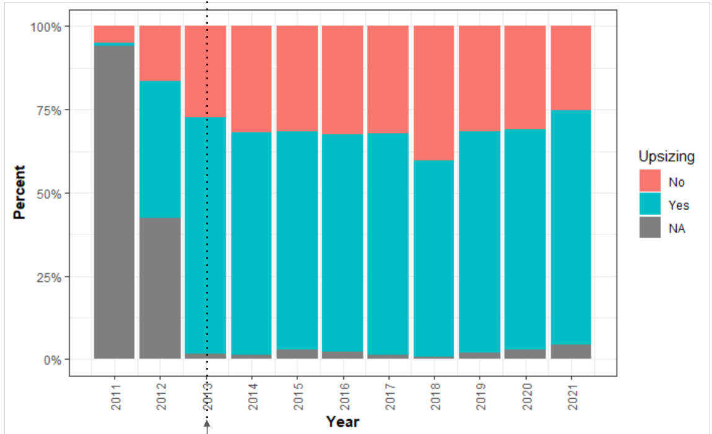
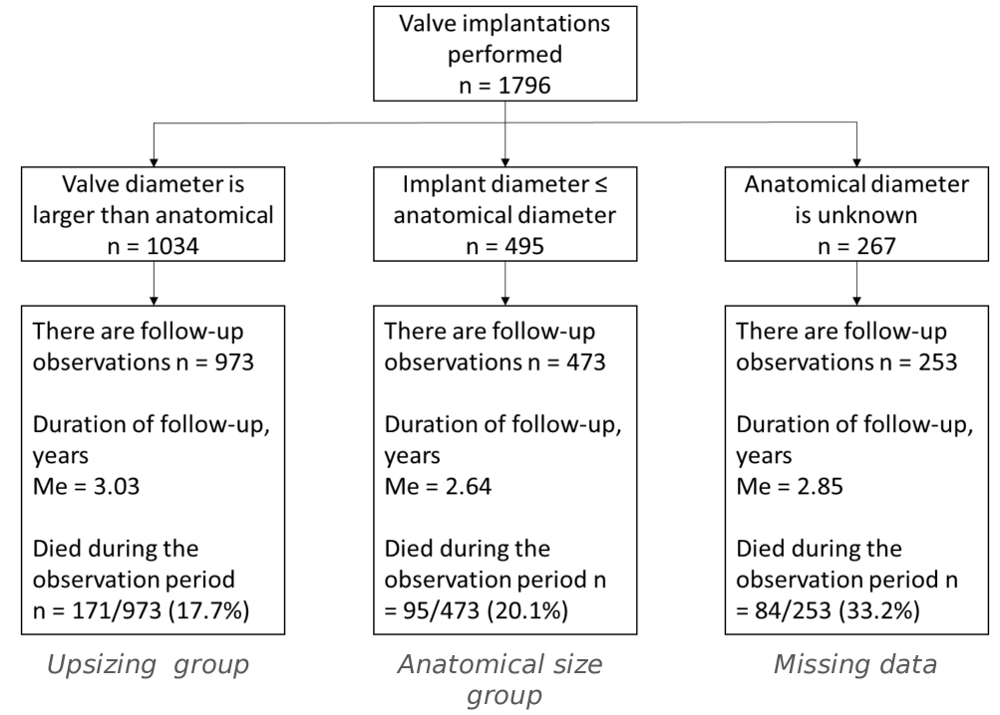
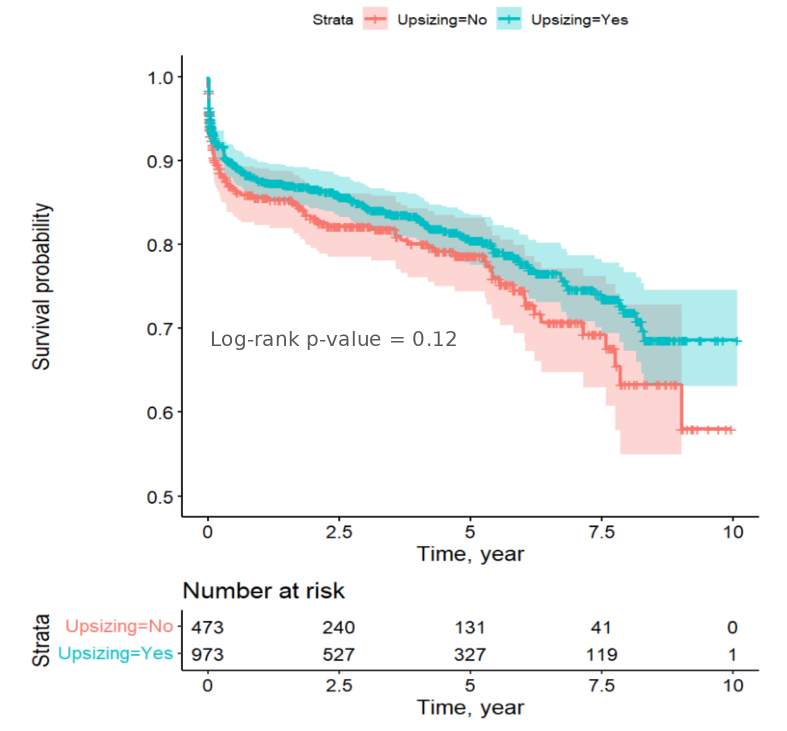
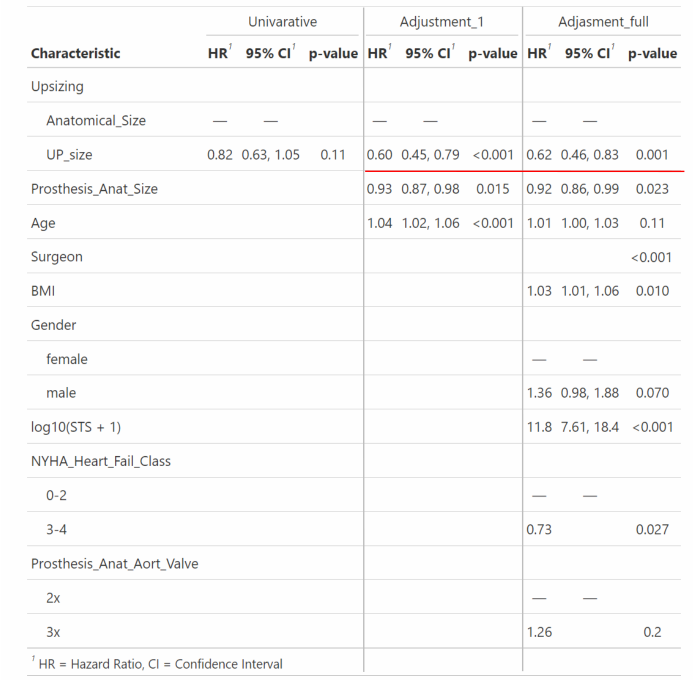
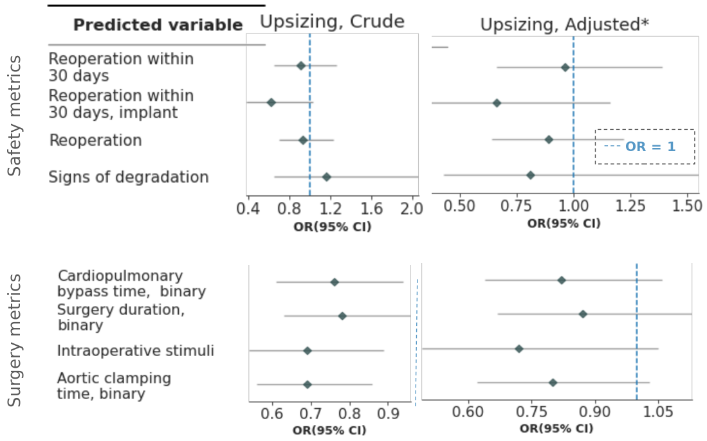

# About the project

This is a retrospective cohort study assessing the effectiveness of oversized bioprosthesis in aortic valve disease. It was conducted under the supervision of Artemiy Okhotin, MD[^1] .
[^1]: Tarusa Hospital, K. Libknekhta st. 16, 249100, Tarusa, Russia; Information Technologies, Mechanics and Optics University, Kronverkskiy Prospekt 49, 197101, St. Petersburg, Russia.

## Introduction
The aortic valve permits blood to flow in one direction, from the left ventricle to the aorta. The most common disease of the aortic valve is aortic stenosis [1], which leads to an increased transvalvular pressure gradient. Its main cause is calcification of the valve leaflets [2]. A scheme of normal aortic valve and a valve under a stenosis is shown at Figure 1.

***Figure 1.** Normal aortic valve and aortic valve under a stenosis.* 

During aortic valve replacement surgery, the standard procedure is direct intraoperative measurement of the aortic annulus and implantation of the prosthesis of the measured size [3]. The placement of a larger (oversized) prosthesis reduces the mean pressure gradient (MPG) across the valve.  An example of bioprosthesis is shown at Figure 2.

***Figure 2.** Bioprosthesis example.*

# Study design, aims and tasks
Patients with aortic valve disease were operated from 03.02.2011 to 17.02.2021 using biological prostheses. The data was analyzed in the retrospective cohort study evaluating the effectiveness of oversized bioprosthetic valves in treating aortic valve disease.

## Aims and tasks

The **aim** of the current work is to evaluate the association of implanting an oversized versus anatomical size valve prosthesis with survival and mean pressure gradient.

**Tasks**:
* Comparison of overall survival (OS) of patients between the two groups
* Evaluation of the association of hemodynamic parameters (MPG, EF) after surgery in the study groups
*  Evaluation of the safety of upsizing valve implantation
* Multiple imputation for anatomical valve diameter

## Materials and methods

This study included 1796 participants: 1423 (79%) male and 373 (21%) female. Ninety seven patients were excluded from the study due to lack of follow-up data. Patients were divided according to the size of bioprosthesis into 2 groups: patients who received prostheses of anatomical size (n=473) and patients who received oversized prostheses (n=973). The median age of the population was Me(IQR): 69 (62, 76) and 71 (64; 76) years for group 1 and group 2 of which 18 and 21% were female. Separate analysis, including data imputation, was performed on 253 patients without data on anatomical size of aortic annulus.
Statistical analysis was performed in R version 4.3.2 (R Foundation for Statistical Computing, Vienna, Austria). Categorical variables are summarized as number and percentage, and continuous variables are summarized as mean ± standard deviation and median (interquartile range). P-values are based on the χ2 test for categorical variables, and Welch's t-test was used for continuous variables. 
Mortality was analyzed in a survival analysis using the Kaplan-Meier curves and log-rank test. We built a Cox proportional hazards regression model, with possible confounders included as covariates. For the analysis of echocardiography parameters, surgery, safety, and life quality data, we constructed linear regression models (linear regression coefficient β, 95% CI; logistic and ordinal regressions’ exponentiated coefficient, or OR, with 95% CI). We used the MICE (Multivariate Imputation by Chained Equations) algorithm for imputing missing values and Rubin’s rules for estimation.
Differences were considered significant at p-value < 0.05.

# Results

## EDA
Groups with and without upsizing (oversizing), and with missing anatomical prosthesis size (upsizing = NA) were distributed unequally by years of surgery (Figure 3), N=1796, p=0.0005 (Pearson's Chi-squared test with Monte Carlo simulation). 

***Figure 3**. Distribution of upsizing by years of surgery. The arrow indicates the year when low-invasive aortic valve replacement procedure number surpassed surgical replacement in Germany [4].* 

253 patients were included into a separate group, because their anatomical diameter was unknown, see Figure 4.

***Figure 4.** CONSORT diagram of the study.*

There was a difference between groups in anatomical valve diameter (Me(IQR): 25 (25, 27) vs 23 (23; 25), p<0.001), operating surgeon (p<0.001) and age of patients (Me(IQR): 69 (62, 76) vs 71 (64; 76), p<0.001), see Figure 5.

***Figure 5.** Descriptive statistics of groups.*

Groups weren't different by any comorbidity (Figure 6), p-value = 0.093
(Pearson's Chi-squared test with Monte Carlo simulation), assessed  as follows:
•  Atrial fibrillation: 0 – no, 1:3 – yes 
•  Diabetes : 1 – no, 8 – NA, 2:6 – yes
•  Hypertension: 9 – NA, 0 – no, 1:4 – yes 
•  Congestive heart failure: 0 – no, 1:4 – yes 
•  Peripheral artery disease: 0 – no, 1:3 – yes 
•  Renal Failure: 0 – NA, 1 – no, 2:5 – yes 
•  Coronary  Artery Disease: 0 – no, 1:4 – yes 

***Figure 6.** Upsizing groups by comorbidities, percentage of disease present from the upsizing group.* 

## Survival and Imputation
See the full analysis report for survival assessment [here](https://htmlpreview.github.io/?https://github.com/zhakota/IAK3/blob/main/Survival.html).
The median follow-up was 32 (1.3; 64) and 36 (3.5; 69) months for group 1 and group 2, respectively. Median survival was not reached during the follow-up period, 75% percentile of unadjusted survival was 5.82 (95% CI: 4.70, 7.75) vs 6.84 (95% CI: 5.92, 8.31) years, for group 1 and group 2, respectively (log-rank p=0.112). See Figure 7 for Kaplan-Meier plot.

***Figure 7.** Kaplan-Meier estimator for the upsizing groups.* 

After adjustment for covariates (Age, Surgeon, Body mass index, or BMI, Sex, New York Heart Association, or NYHA, heart failure class, Society of Thoracic Surgeons, or STS, score, and anatomical size of the prosthesis), survival in the oversizing group was higher than in the anatomic diameter group (HRadj: 0.62; 95% CI: 0.46, 0.83; p=0.001). Figure 8 depicts univariate and multivariate models.  

***Figure 8.** Cox regression analysis for Upsizing with different covariates.*

This result was robust across the subgroups (Age: <70, ≥70 year; BMI: <30, ≥30; Sex; NYHA class: 3-4, 0-2 heart fail class; Anatomical valve size: <26, ≥26; STS score: <3; ≥3 score), survival was not significantly different in any subgroup (Figure 9). 

***Figure 9.** Cox regression analysis for Upsizing in different subgroups. None of the estimations had HR>1.*

Imputation of a missing anatomic valve diameter did not change the effect of oversizing bioprosthesis (for predictive mean matching HRadj: 0.63, 95% CI: 0.48, 0.83; for worst case scenario HRadj: 0.71, 95% CI: 0.54, 0.93), Figure 10. 

***Figure 10**. Results for imputed anatomical size and for the worst scenario (all of the imputed values were with upsizing).*

## Echocardiographic parameters
During the analysis of echocardiography parameters, we identified that the adjusted (for MPG before operation, time to follow-up, anatomical size of the prosthesis) MPG on follow-up was significantly lower in the oversizing group (β = −2.5, 95% CI: −4.8, −0.2 mmHg). However, the adjusted (for ejection fraction before operation, time to follow-up, anatomical size of the prosthesis) ejection fraction did not differ between two groups (β = 1.4, 95% CI: −0.9, 3.7 %). See Figure 11 for the results.

***Figure 11.** Echocardiographic parameters and Upszing.*

## Safety, surgery and life quality metrics
See [report](https://htmlpreview.github.io/?https://github.com/zhakota/IAK3/blob/main/Safety_Surgery_metrics_life_quality.html)  for the surgery, safety and life quality data assessment for full results.
Adjusting for covariates (Surgeon, Surgery Urgency, NYHA class, Sex, BMI, log-scaled STS score, endocarditis, pre-surgery implant, and prosthesis size), oversizing did not affect surgery duration (β = 0.5, 95% CI: -8.5, 9.5 min) or cardiac pacing (OR=0.82, 95% CI: 0.56, 1.21). However, it significantly reduced cardiopulmonary bypass time by 5.8 min (β = −5.8, 95% CI: −11, −0.6 min) and aortic clamping time by 5.1 min (β = −5.1, 95% CI: −8.2, −1.9 min). Crude and adjusted variants for categorical variables (divided by median) are shown at Figure 12.
After adjusting for NYHA class, Sex, BMI, log-scaled STS score, and prosthesis size, safety metrics showed no significant differences between anatomical size groups and oversizing groups, including prosthetic valve degeneration (OR: 0.8, 95% CI: 0.4, 1.5), overall reoperations (OR = 0.8, 95% CI: 0.6, 1.1), and reoperations within 30 days (OR = 0.9, 95% CI: 0.6, 1.3). See Figure 12. Quality of life metrics, including pain, self-care, daytime activity, and fear, did not significantly differ between groups (ORs ranging from 0.9 to 1.1, lowest p=0.46). 

***Figure 12.** Safety and Surgery metrics, binarized by median for numerical values. Upsizing did not worsen any metric in any setting.*

# Conclusions
Oversizing of bioprosthesis was associated with better adjusted survival, and multiple imputation of missing values for anatomical valve diameter have not impacted the results. We confirmed that there was an improvement in hemodynamics in the oversizing group on follow-up, specifically a reduction of MPG. We showed that oversizing of bioprosthesis was not associated with reoperations, prosthesis degeneration, post-surgery life quality metrics, surgery duration and cardiac pacing, and cardiopulmonary bypass and aortic clamping time were significantly reduced in the oversizing group.

We tried to account for the following limitations:
1. Our study is a retrospective single-center observational study
2. Our data contained Loss to Follow-Up, Missing Values, Non-informative Dropouts
3. Our data contained Group Imbalance and Bias 

Team members' contribution:
* Dmitrii Zhakota - repo, EDA, PCA, imputation
* Alexander Popov  - Dates and outcome data cleaning, STROBE quality control, CONSORT chart, survival analysis, statistical analysis plan
* Nadezhda Lukashevich - translation, DAG, safety, surgery metrics analysis, readme
* Irina Filimonova -  analysis of publications, analytic work (DAG), data visualisation, regression analysis of Echocardiographic parameters

# References

1. Durko, A. P., Osnabrugge, R. L., Van Mieghem, N. M., Milojevic, M., Mylotte, D., Nkomo, V. T., et al. (2018). Annual number of candidates for transcatheter aortic valve implantation per country: current estimates and future projections. *European Heart Journal*, 39, 2635–2642. [https://doi.org/10.1093/eurheartj/ehy107](https://doi.org/10.1093/eurheartj/ehy107)
2. Otto, C. M., Nishimura, R. A., Bonow, R. O., Carabello, B. A., Erwin, J. P., Gentile, F., et al. (2021). 2020 ACC/AHA guideline for the management of patients with valvular heart disease: Executive summary: A report of the American College of Cardiology/American Heart Association Joint Committee on Clinical Practice Guidelines. Circulation, 143. [https://doi.org/10.1161/CIR.0000000000000932](https://doi.org/10.1161/CIR.0000000000000932)
3. Wang, H., Hanna, J. M., Ganapathi, A., Keenan, J. E., Hurwitz, L. M., Vavalle, J. P., et al. (2015). Comparison of aortic annulus size by transesophageal echocardiography and computed tomography angiography with direct surgical measurement. *American Journal of Cardiology*, 115, 1568–1573. [https://doi.org/10.1016/j.amjcard.2015.02.060](https://doi.org/10.1016/j.amjcard.2015.02.060)
4. Kim, W.-K., & Hamm, C. W. (2018). Transcatheter aortic valve implantation in Germany. _Clinical Research in Cardiology, 107_(8). https://doi.org/10.1007/s00392-018-1297-0
